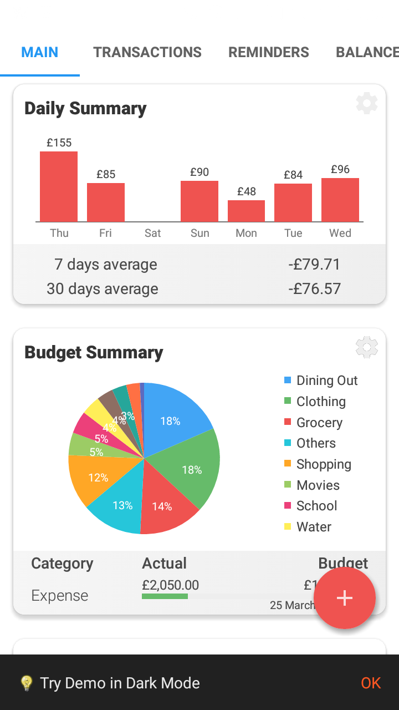
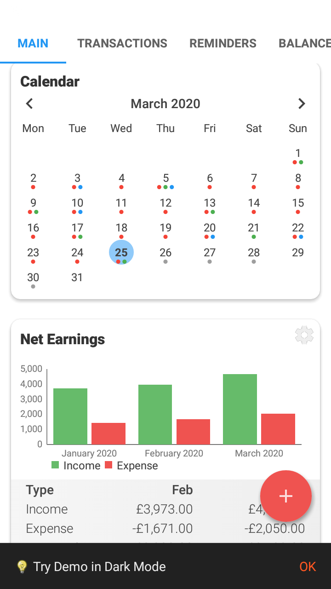
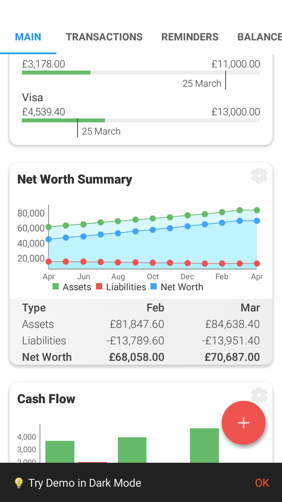
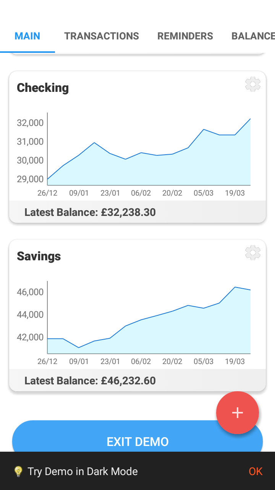
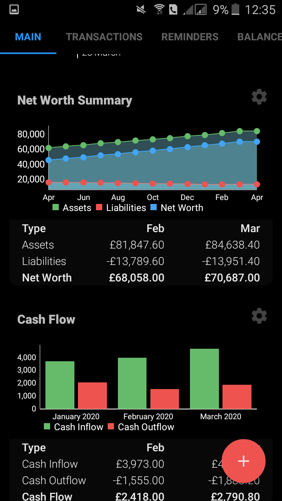
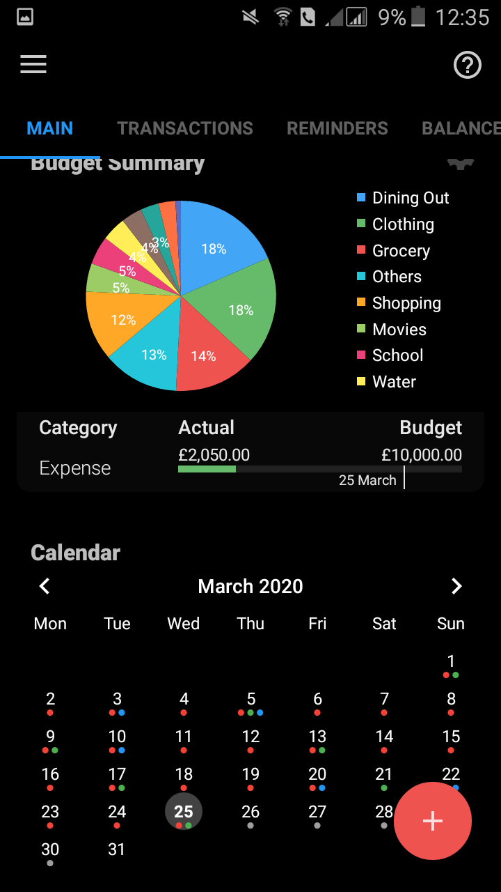

# Budgex [In Progress]
This App Currently is a Simple Budget Manager Show Analytics Based on Your Past Transactions 

## Features
*  Localization
*  Persistant Storage With Hive
*  Customizable Charts

## Future Plans
* Add Rasa Chatbot for Better UX
* Add My Custom Rienforcement Learning Agent For Predicting User Fture Behavoir and get Insigts

## Concept UI

     
     

## Todo

- [ ] Notification
- [ ] Complete the Redesign UI
- [ ] Dark Mode 
- [ ] Add Profile & Settings Pages
- [ ] Migrate From Firebase Backend To Nest GraphQL